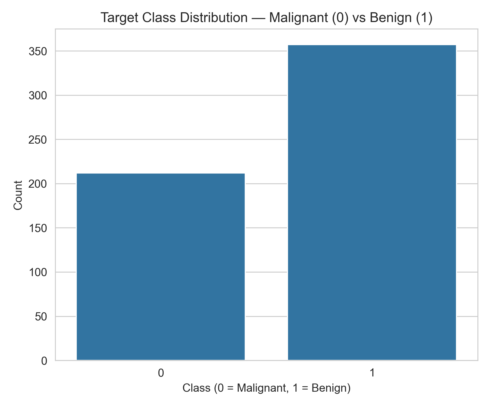
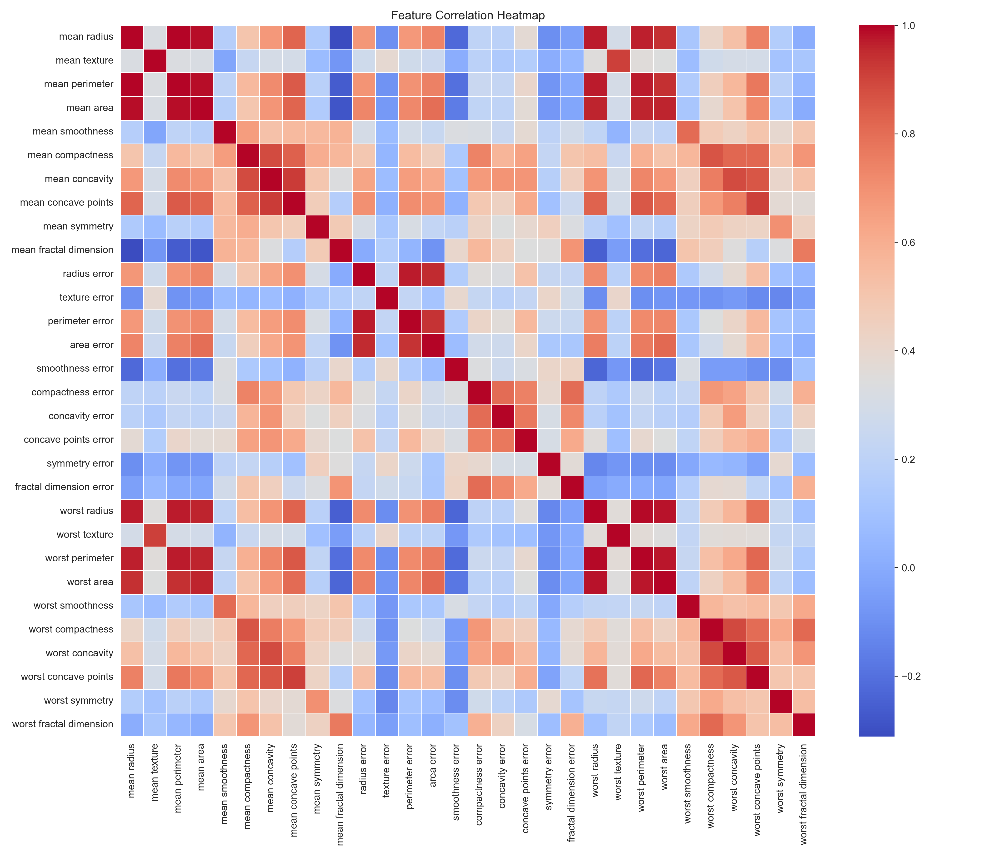
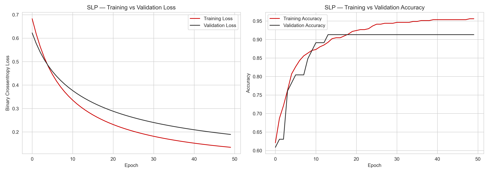
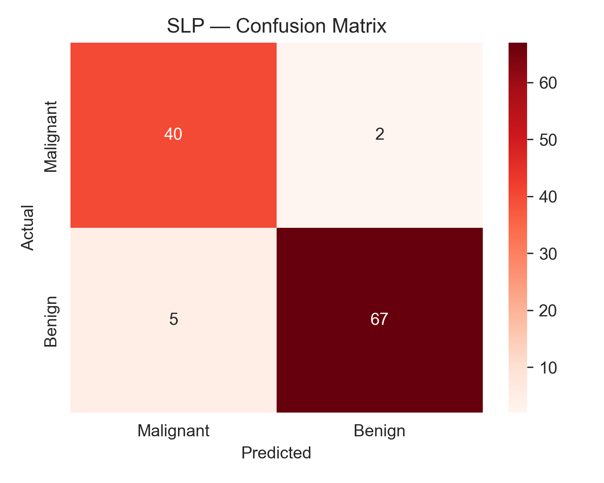
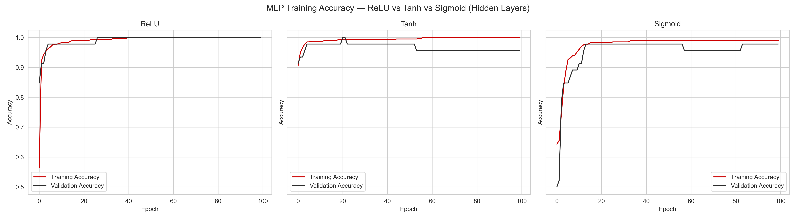
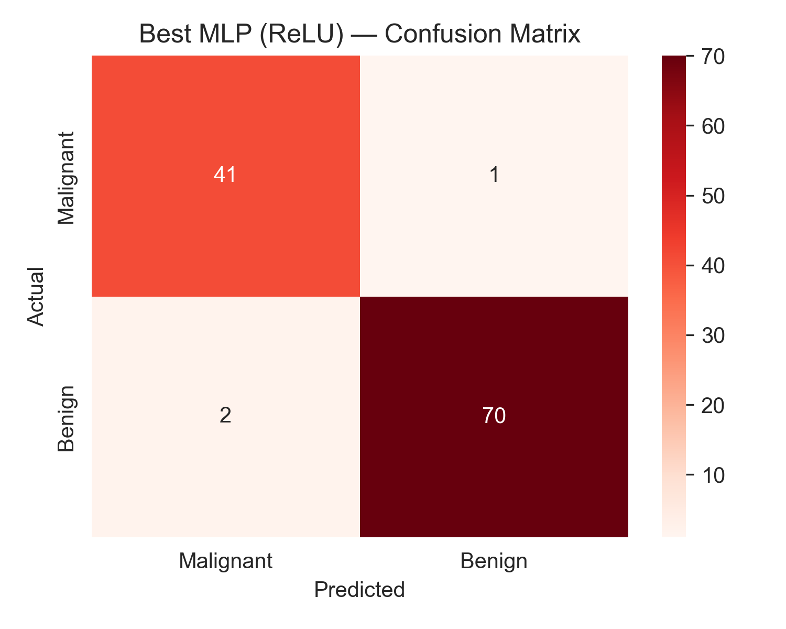
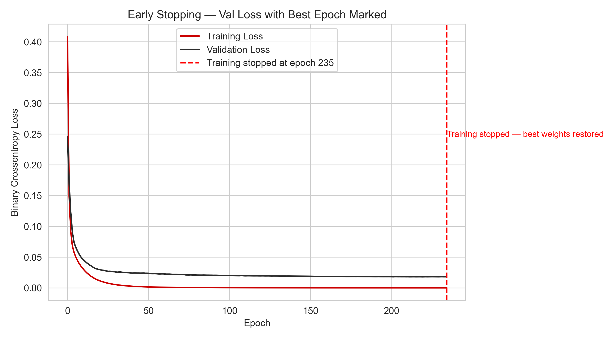
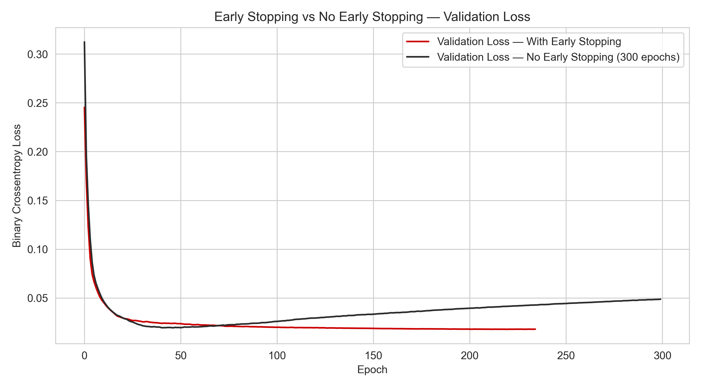
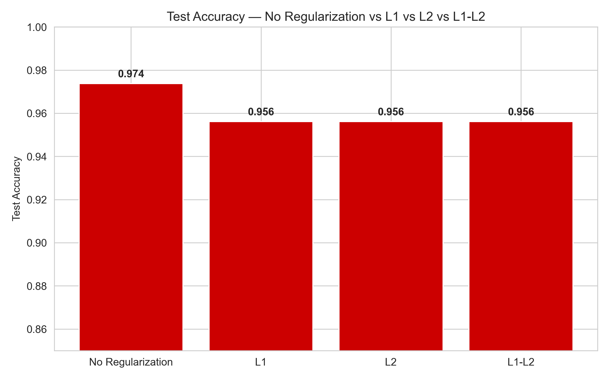

<div align="center">

# 🧬 Breast Cancer Diagnosis with Deep Learning
### SLP → MLP → Regularised, Dropout-Equipped Neural Network

**From a single neuron to a production-grade classifier — benchmarked, explained, and clinically interpreted.**

[](https://www.python.org/)
[](https://www.tensorflow.org/)
[](https://keras.io/)
[](https://scikit-learn.org/)
[](https://jupyter.org/)
[](#-license)

<sub>Red & White Skill Education · Deep Learning PR 1 · Total Marks: 10</sub>

</div>

---

## 📌 Table of Contents

- [Overview](#-overview)
- [Dataset](#-dataset)
- [Project Structure](#-project-structure)
- [Techniques Covered](#-techniques-covered)
- [Results at a Glance](#-results-at-a-glance)
- [Visual Walkthrough](#-visual-walkthrough)
  - [1. Exploratory Data Analysis](#1--exploratory-data-analysis)
  - [2. Single-Layer Perceptron (Baseline)](#2--single-layer-perceptron-baseline)
  - [3. Multi-Layer Perceptron & Activation Functions](#3--multi-layer-perceptron--activation-functions)
  - [4. Early Stopping](#4--early-stopping)
  - [5. Regularization (L1 / L2 / ElasticNet)](#5--regularization-l1--l2--elasticnet)
- [Full Model Comparison](#-full-model-comparison)
- [Clinical Insight](#-clinical-insight)
- [Getting Started](#-getting-started)
- [Tech Stack](#-tech-stack)
- [Video Walkthrough](#-video-walkthrough)
- [Author](#-author)
- [License](#-license)

---

## 🔬 Overview

This project builds a deep-learning classifier for the **Breast Cancer Wisconsin (Diagnostic)** dataset,
progressing deliberately through **seven stages** — each one motivated by the limitation of the stage
before it:

```
Single-Layer Perceptron ──▶ Multi-Layer Perceptron ──▶ Early Stopping ──▶ Dropout ──▶ Regularization ──▶ Final Combined Model
     (linear baseline)      (non-linear boundaries)     (stop overfitting)  (redundancy)  (weight shrinkage)  (production-ready)
```

The goal isn't just to hit a high accuracy number — it's to **understand why each technique works**,
quantify its effect experimentally, and translate the final results into a real clinical
recommendation (where a missed cancer diagnosis is far more costly than a false alarm).

---

## 🗂 Dataset

| | |
|---|---|
| **Name** | Breast Cancer Wisconsin (Diagnostic) |
| **Source** | `sklearn.datasets.load_breast_cancer()` — also on [UCI ML Repository](https://archive.ics.uci.edu/dataset/17/breast+cancer+wisconsin+diagnostic) |
| **Samples** | 569 (212 Malignant · 357 Benign) |
| **Features** | 30 numeric — mean / SE / worst of 10 cell-nucleus measurements |
| **Target** | Binary — `0 = Malignant`, `1 = Benign` |
| **Missing values** | None |
| **License** | Public Domain |

<p align="center">
  
</p>

The classes are mildly imbalanced (~37% / 63%) — not severe enough to require resampling, but enough
that **recall on the Malignant class** is tracked closely throughout, not just overall accuracy.

---

## 📁 Project Structure

```
📦 breast-cancer-deep-learning
 ┣ 📜 DL_PR1.ipynb              → main notebook (all 7 tasks)
 ┣ 📜 DL_PR1.html               → exported HTML version
 ┣ 📜 requirements.txt          → pinned dependencies
 ┣ 📜 README.md                 → you are here
 ┗ 📂 images
    ┣ 🖼 class_distribution.png
    ┣ 🖼 feature_correlation.png
    ┣ 🖼 slp_training_curves.png
    ┣ 🖼 slp_confusion_matrix.png
    ┣ 🖼 mlp_activation_comparison.png
    ┣ 🖼 mlp_confusion_matrix_ReLU.png
    ┣ 🖼 early_stopping_curves.png
    ┣ 🖼 early_stopping_comparison.png
    ┗ 🖼 regularization_comparison.png
```

---

## 🧠 Techniques Covered

<table>
<tr><td width="50%" valign="top">

**Preprocessing**
- Stratified train/test split
- `StandardScaler` (fit on train only)

**Architecture**
- Single-Layer Perceptron (31 params)
- Multi-Layer Perceptron (64 → 32 → 1)

**Activation Functions**
- ReLU · Tanh · Sigmoid (hidden layers)

</td><td width="50%" valign="top">

**Overfitting Control**
- `EarlyStopping` (patience, best-weight restore)
- `Dropout` (0.1 / 0.3 / 0.5 rates)
- L1 · L2 · L1-L2 (ElasticNet) regularization

**Evaluation**
- Precision / Recall / F1 per model
- Confusion matrices
- Clinical threshold analysis

</td></tr>
</table>

---

## 🏆 Results at a Glance

<div align="center">

| Rank | Model | Test Accuracy | Precision | Recall | F1-Score |
|:---:|---|:---:|:---:|:---:|:---:|
| 🥇 | **MLP + L1 Regularization** | **96.49%** | 98.57% | 95.83% | **97.18%** |
| 🥈 | MLP-ReLU (baseline architecture) | 95.61% | 98.55% | 94.44% | 96.45% |
| 🥈 | MLP + Early Stopping | 95.61% | 98.55% | 94.44% | 96.45% |
| 🥈 | MLP + Dropout (0.3) | 95.61% | 98.55% | 94.44% | 96.45% |
| 🥈 | MLP + L2 Regularization | 95.61% | 98.55% | 94.44% | 96.45% |
| 🥈 | MLP + L1-L2 (ElasticNet) | 95.61% | 98.55% | 94.44% | 96.45% |
| 🥈 | Final Combined (Dropout + L2 + ES) | 95.61% | 98.55% | 94.44% | 96.45% |
| — | SLP (linear baseline) | 92.11% | 94.37% | 93.06% | 93.71% |

</div>

> Every regularised MLP comfortably beats the linear SLP baseline (+3.5–4.4 points of accuracy), confirming
> that this dataset benefits from a non-linear decision boundary. Full metric definitions and the
> highlighted comparison table are in [`DL_PR1.ipynb`](DL_PR1.ipynb).

---

## 🖼 Visual Walkthrough

### 1 · Exploratory Data Analysis

<details open>
<summary><b>Feature Correlation Heatmap</b> — click to expand/collapse</summary>
<br>

<p align="center">
  
</p>

`radius`, `perimeter`, and `area` (mean / worst) are strongly correlated, as expected geometrically.
Unlike linear models, a neural network isn't destabilised by this redundancy — its hidden layers learn
distributed, non-linear combinations of correlated inputs rather than a single fragile coefficient per
feature.

</details>

---

### 2 · Single-Layer Perceptron (Baseline)

<table>
<tr>
<td width="55%">

</td>
<td width="45%">

</td>
</tr>
</table>

A single neuron (31 parameters) trained for 50 epochs converges smoothly and reaches **92.1%** test
accuracy — a solid but structurally limited baseline. It can only draw **one straight hyperplane**
through 30-dimensional space, misclassifying **7 of 114** test cases (2 malignant cases missed).

---

### 3 · Multi-Layer Perceptron & Activation Functions

<p align="center">
  
</p>

| Activation | Behaviour in hidden layers |
|---|---|
| **ReLU** | Fastest, most stable convergence — no vanishing gradient for positive inputs |
| **Tanh** | Zero-centred, but can still saturate in deeper stacks |
| **Sigmoid** | Not zero-centred; severe vanishing-gradient risk — reserved for the output layer only |

<p align="center">
  
</p>

Adding two hidden layers with **ReLU** activation lifts test accuracy from 92.1% → **95.6%**, and cuts
missed-malignant errors from 2 down to **1 out of 43**.

---

### 4 · Early Stopping

<table>
<tr>
<td width="50%">

</td>
<td width="50%">

</td>
</tr>
</table>

Trained for up to 300 epochs, `EarlyStopping(monitor='val_loss', patience=15, restore_best_weights=True)`
detects the point where validation loss stops improving (**epoch 235** in this run) and rewinds the
model to its best-generalising weights — while the no-callback model's validation loss visibly **creeps
back up** after ~epoch 100 as it starts overfitting.

---

### 5 · Regularization (L1 / L2 / ElasticNet)

<p align="center">
  
</p>

| Penalty | Formula | Effect |
|---|---|---|
| **L1** | `λ·Σ\|w\|` | Drives weak-feature weights to **exactly zero** → sparsity / built-in feature selection |
| **L2** | `λ·Σw²` | Shrinks all weights smoothly → smoother decision boundary, handles correlated features well |
| **L1-L2** | both | ElasticNet — L2 handles correlated features, L1 prunes the truly uninformative ones |

In this run, **L1 regularization alone came out on top** (96.5% accuracy, 97.2% F1) — a reminder that
theory gives you a strong prior, but the best regulariser is still an empirical question for each
dataset.

---

## 📊 Full Model Comparison

The notebook builds a single results table (styled with `pandas.Styler.highlight_max`) covering every
model trained across all seven tasks — architecture, regularization, dropout rate, early stopping
status, and full precision/recall/F1 breakdown. See **Task 7.2** in [`DL_PR1.ipynb`](DL_PR1.ipynb) for
the live, highlighted version.

---

## 🩺 Clinical Insight

> **False negatives (missed cancers) are far more costly than false positives (unnecessary follow-ups)
> in this domain.** The recommendation below is written with that asymmetry front and center.

- **Deployment candidate:** the Final Combined Model (Dropout + L2 + Early Stopping) is the most
  robust choice for a decision-support tool — it stacks every regularisation technique studied here, so
  it should generalise best to new patients rather than fitting quirks of this training sample.
- **Classification threshold:** the default `0.5` is too conservative for this use case. Lowering the
  threshold (e.g. toward ~0.3, tuned via a precision-recall curve) biases the model toward flagging
  borderline cases for human review rather than clearing them outright.
- **Most impactful technique:** **Early Stopping** delivers the clearest, most directly visible
  generalisation gain — but Dropout and L2 add complementary, structural regularisation on top of it,
  which is why the *combination* forms the strongest overall model.

---

## 🚀 Getting Started

```bash
# 1. Clone the repository
git clone https://github.com/<your-username>/breast-cancer-deep-learning.git
cd breast-cancer-deep-learning

# 2. (Recommended) create a virtual environment
python -m venv venv
source venv/bin/activate      # Windows: venv\Scripts\activate

# 3. Install dependencies
pip install -r requirements.txt

# 4. Launch the notebook
jupyter notebook DL_PR1.ipynb
```

Then: **Kernel → Restart & Run All** for a clean, reproducible end-to-end run.

---

## 🛠 Tech Stack

<div align="center">


</div>

```
tensorflow>=2.12.0
scikit-learn>=1.4.0
pandas
numpy
matplotlib
seaborn
```

---

## 🎥 Video Walkthrough

<div align="center">

https://www.loom.com/share/ffd7b724595f4f0aa001f0a1af1bdaa4

Covers: data scaling rationale · SLP vs MLP · activation functions · Early Stopping parameters ·
Dropout's train/inference behaviour · L1 vs L2 · clinical precision/recall trade-off.

</div>

---

## 👤 Author

**Maitrak Kunjadiya**
🎓 Red & White Skill Education — Deep Learning, PR 1


---

## 📄 License

This project was created for academic purposes as part of the **Red & White Skill Education** Deep
Learning curriculum. The Breast Cancer Wisconsin (Diagnostic) dataset is public domain, courtesy of the
UCI Machine Learning Repository.

<div align="center">

*Red & White Skill Education · Since 2008 · "Shaping Skills for Scaling Higher...!!!"*

⭐ **If this project helped you, consider giving it a star!** ⭐

</div>
